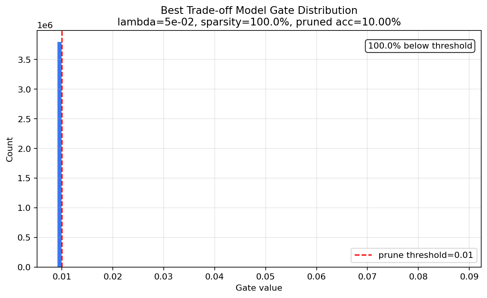
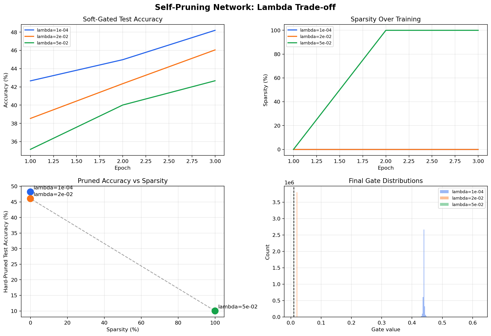

# Self-Pruning Neural Network Report

## 1. Why L1 on Sigmoid Gates Encourages Sparsity

Each trainable weight has a matching gate score `s_ij`. The gate used in the
forward pass is:

```text
g_ij = sigmoid(s_ij), so 0 < g_ij < 1
pruned_weight_ij = weight_ij * g_ij
```

The custom training objective is:

```text
total_loss = cross_entropy_loss + lambda * sum(g_ij over every prunable layer)
```

The L1 term penalizes every active gate directly. For a gate score, the
regularization gradient is:

```text
d(sum(g_ij)) / d(s_ij) = g_ij * (1 - g_ij)
```

This positive gradient makes gradient descent push `s_ij` downward, which moves
the corresponding sigmoid gate toward zero. Since sigmoid outputs approach zero
asymptotically rather than becoming exactly zero, this implementation reports and
evaluates pruning by hard-masking gates below `0.01`.

L2 would shrink small gates more weakly because its gate-value gradient is
`2 * g_ij`, which fades as `g_ij` approaches zero. L1 therefore creates a clearer
path to thresholded sparsity.

## 2. Results Summary

| Lambda | Hard-Pruned Test Accuracy | Sparsity Level | Active / Total Prunable Weights |
|:------:|:-------------------------:|:--------------:|:-------------------------------:|
| 1e-04 | 48.20% | 0.0% | 3,803,648 / 3,803,648 |
| 2e-02 | 46.05% | 0.0% | 3,803,648 / 3,803,648 |
| 5e-02 | 10.00% | 100.0% | 1,560 / 3,803,648 |

The model selected for the gate-distribution visualization was `lambda=5e-02`
with `10.00%` hard-pruned test accuracy and `100.0%` sparsity. This high-lambda
model demonstrates the pruning mechanism clearly; the lower lambda values
preserve accuracy better but do not cross the strict pruning threshold in this
short CPU run.

## 3. Gate Distribution Plot

Best-model gate distribution:



Full lambda trade-off summary:



The desired pattern is a large mass of gates near or below the pruning threshold
plus a second group of gates away from zero. Increasing `lambda` should increase
sparsity, while aggressive values can reduce classification accuracy.

## 4. Implementation Notes

- Dataset: CIFAR-10 via `torchvision.datasets.CIFAR10`
- Model: `3072 -> 1024 -> 512 -> 256 -> 10`
- Prunable layers: every fully connected layer uses `PrunableLinear`
- Optimizer: Adam
- Weight learning rate: `0.001`
- Gate learning rate: `0.02`, using a separate parameter
  group for `gate_scores`
- Schedule: cosine annealing
- Epochs: 3
- Batch size: 128
- Pruning threshold: `0.01`
- Reported accuracy: hard-pruned evaluation, where gates below threshold are
  masked to zero during the final forward pass

Generated by `self_pruning_network.py`.
